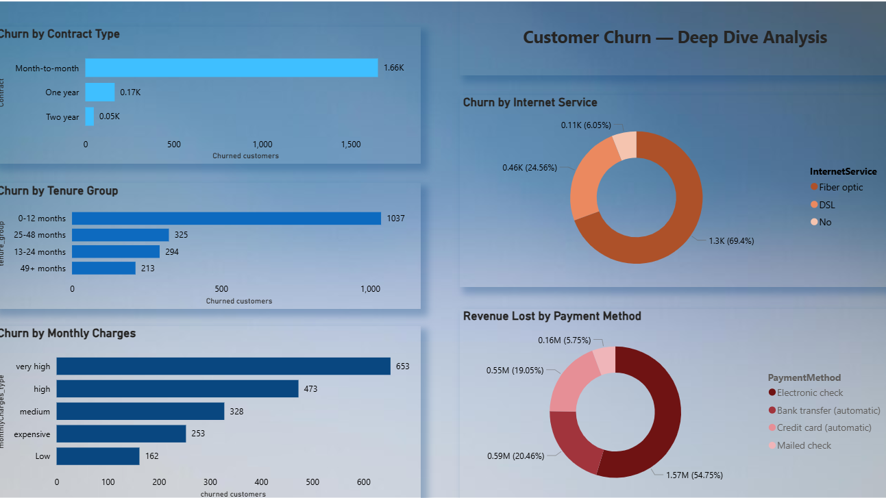

# Customer Churn Analysis

## Project Overview
End-to-end analysis of telecom customer churn using Databricks SQL, MySQL, Power BI and GitHub.

## Tools Used
- **Databricks SQL** — Data exploration and analysis
- **MySQL** — Data storage, cleaning and advanced queries
- **Power BI** — Interactive dashboard
- **Trello** — Project management

## Dataset
- Source: Kaggle — Telco Customer Churn
- Original dataset: **7043 rows, 21 columns**
- After cleaning: **7032 rows** (11 rows removed due to empty TotalCharges values)

## Data Cleaning
- Renamed table for better readability
- Identified and removed 11 rows with empty `TotalCharges` values
- Converted `TotalCharges` column datatype from **STRING to DOUBLE** for accurate calculations
- Verified data quality using COUNT and WHERE filters

## Key Business Insights
- Overall churn rate: **26.58%**
- Month-to-month contracts churn at **42.71%**
- New customers (0-12 months) churn at **47.44%**
- Fiber optic customers churn at **41.89%**
- Total revenue lost: **$2.86 Million**
- Electronic check users account for **54.75%** of total revenue lost

## SQL Queries
| File | Description |
|---|---|
| 01_overall_churned_customer_rate.sql | Overall churn rate |
| churn by contract type.sql | Churn by contract |
| churn by tenure period.sql | Churn by tenure group |
| churn by internet service.sql | Churn by internet service |
| Churn by monthly charges.sql | Churn by monthly charges |
| revenue lost.sql | Revenue lost from churned customers |
| CTE_churn_rate.sql | Advanced CTE query |
| window_function.sql | Window function query |

## Dashboard Preview
## Dashboard Preview

### Overview Page

### Deep Dive Page

